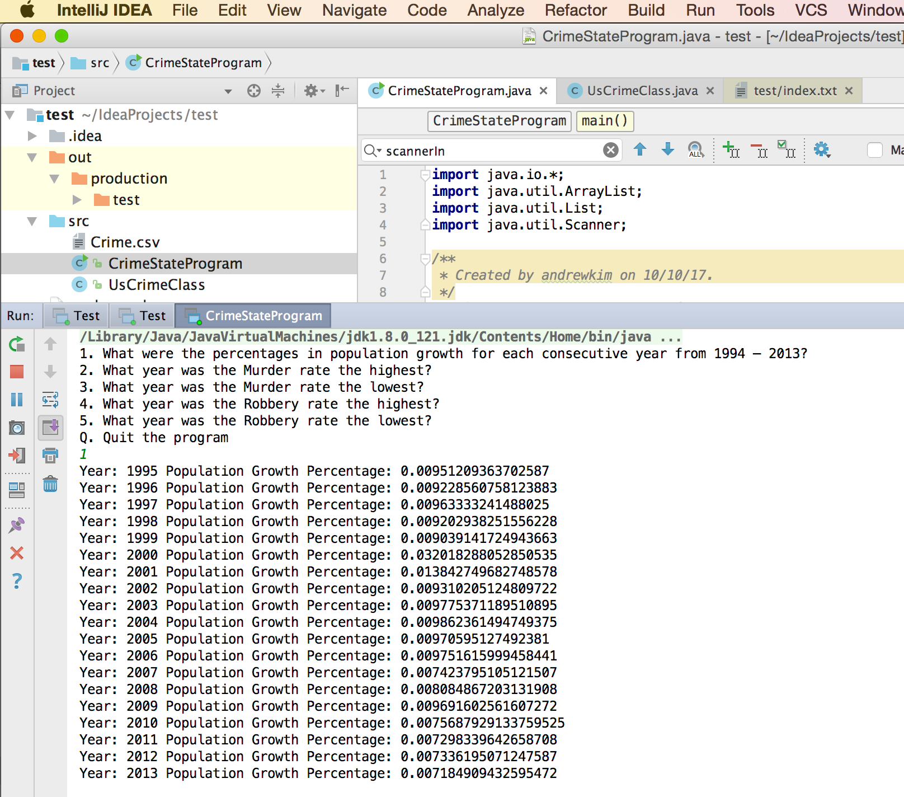
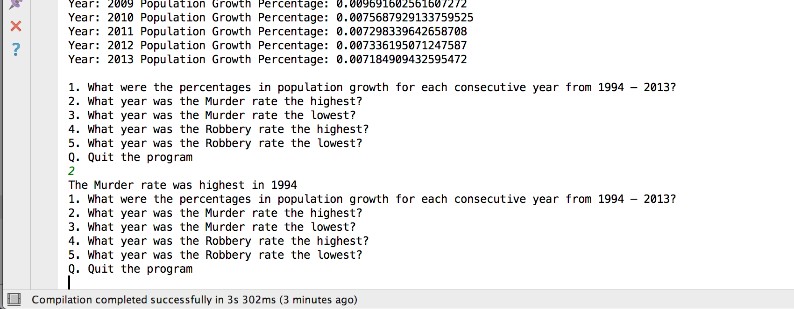
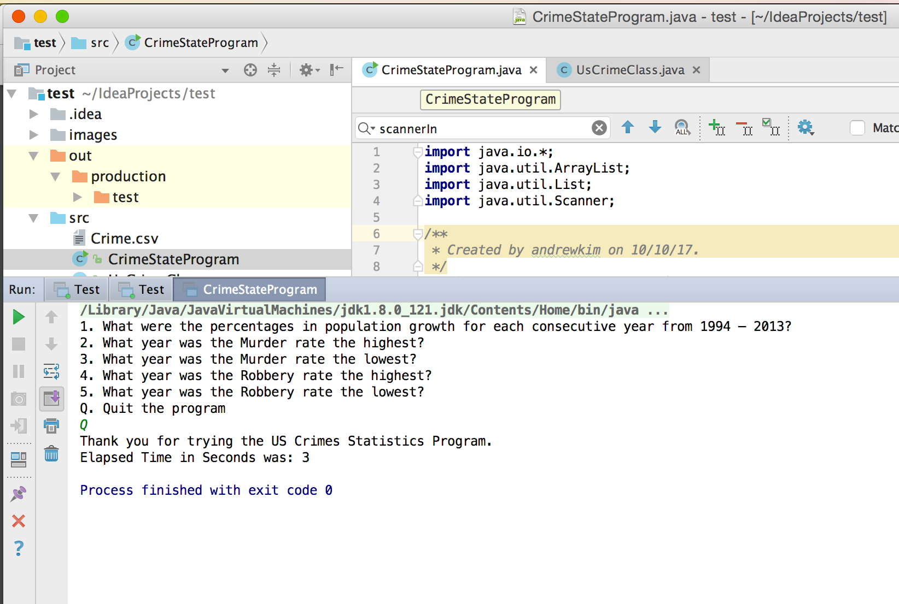

# Homework 2

## Test Case 1 - Passed

### Input

> 1

### Expected Output
```
Year: 1995 Population Growth Percentage: 0.00951209363702587
Year: 1996 Population Growth Percentage: 0.009228560758123883
Year: 1997 Population Growth Percentage: 0.00963333241488025
Year: 1998 Population Growth Percentage: 0.009202938251556228
Year: 1999 Population Growth Percentage: 0.009039141724943663
Year: 2000 Population Growth Percentage: 0.032018288052850535
Year: 2001 Population Growth Percentage: 0.013842749682748578
Year: 2002 Population Growth Percentage: 0.009310205124809722
Year: 2003 Population Growth Percentage: 0.009775371189510895
Year: 2004 Population Growth Percentage: 0.009862361494749375
Year: 2005 Population Growth Percentage: 0.00970595127492381
Year: 2006 Population Growth Percentage: 0.009751615999458441
Year: 2007 Population Growth Percentage: 0.007423795105121507
Year: 2008 Population Growth Percentage: 0.008084867203131908
Year: 2009 Population Growth Percentage: 0.009691602561607272
Year: 2010 Population Growth Percentage: 0.0075687929133759525
Year: 2011 Population Growth Percentage: 0.007298339642658708
Year: 2012 Population Growth Percentage: 0.007336195071247587
Year: 2013 Population Growth Percentage: 0.007184909432595472```

### Actual Output
```
Year: 1995 Population Growth Percentage: 0.00951209363702587
Year: 1996 Population Growth Percentage: 0.009228560758123883
Year: 1997 Population Growth Percentage: 0.00963333241488025
Year: 1998 Population Growth Percentage: 0.009202938251556228
Year: 1999 Population Growth Percentage: 0.009039141724943663
Year: 2000 Population Growth Percentage: 0.032018288052850535
Year: 2001 Population Growth Percentage: 0.013842749682748578
Year: 2002 Population Growth Percentage: 0.009310205124809722
Year: 2003 Population Growth Percentage: 0.009775371189510895
Year: 2004 Population Growth Percentage: 0.009862361494749375
Year: 2005 Population Growth Percentage: 0.00970595127492381
Year: 2006 Population Growth Percentage: 0.009751615999458441
Year: 2007 Population Growth Percentage: 0.007423795105121507
Year: 2008 Population Growth Percentage: 0.008084867203131908
Year: 2009 Population Growth Percentage: 0.009691602561607272
Year: 2010 Population Growth Percentage: 0.0075687929133759525
Year: 2011 Population Growth Percentage: 0.007298339642658708
Year: 2012 Population Growth Percentage: 0.007336195071247587
Year: 2013 Population Growth Percentage: 0.007184909432595472
```
### Screenshot


## Test Case 2 - Passed

### Input

> 2

### Expected Output
```
The Murder rate was highest in 1994
```

### Actual Output
```
The Murder rate was highest in 1994
```

### Screenshot



## Test Case 3 - Passed

### Input

> Q

### Expected Output
```
Thank you for trying the US Crimes Statistics Program.
Elapsed Time in Seconds was: 3
```

### Actual Output
```
Thank you for trying the US Crimes Statistics Program.
Elapsed Time in Seconds was: 3
```

### Screenshot

